# Mimicry

Some loot chests have teeth.

Any loot chest you come across might be a mimic, waiting for you to reach for the latch. Kill it and you get back the loot inside it. Feed it gold instead and it follows you home as a hopping, panting backpack.

Further afield lies Hollowmere: a ruined castle in a sunlit cavern under the hills, still guarded by knights grown over with moss and by the King's Coffer, a mimic far bigger than any chest, sitting in front of the throne. The blacksmith who lives down the road from the old mine has a map, a book and a favour to ask.

**Requirements:** install it on both the client and the server.

| Minecraft | Loaders | Java |
|---|---|---|
| 26.3, 26.2, 26.1.2 | Fabric (with [Fabric API](https://modrinth.com/mod/fabric-api)) or NeoForge | 25 |
| 1.21.1 | Fabric (with Fabric API) or NeoForge | 21 |
| 1.20.1 | Fabric (with Fabric API) or Forge (MinecraftForge 47 or NeoForged 47.1) | 17 |

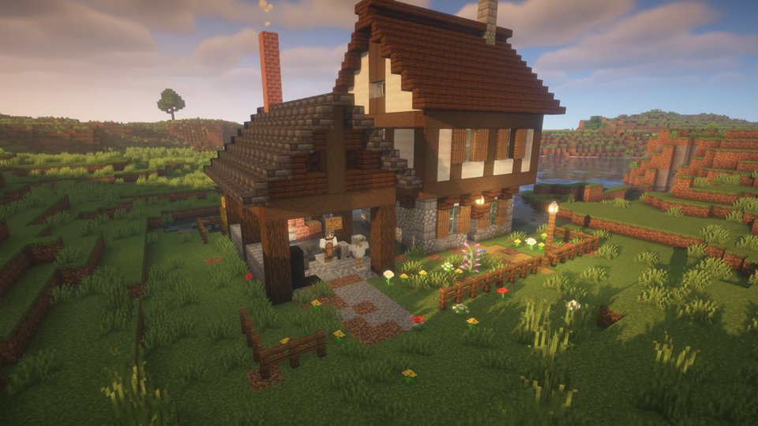

## Mimics

### Any chest could be one

An unopened single loot chest has a 1 in 10 chance to be a mimic. That covers anything with a loot table: dungeons, villages, shipwrecks, temples and the rest. Open it or hit it and it springs out with a shriek. The loot is inside it, so you have to kill it (or tame it) to get that back.

| Two loot chests | One of them is hungry |
|---|---|
| 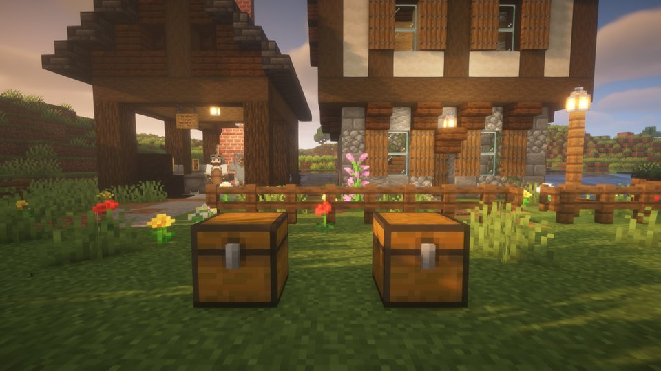 | 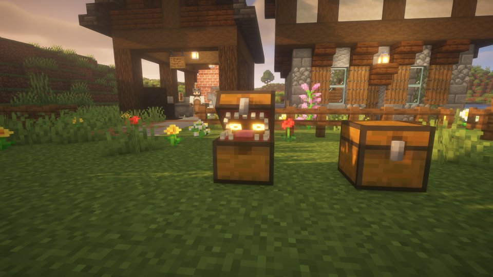 |

Whether a chest is a mimic depends only on the world seed and the chest's position, so the result doesn't change however many times you check, making it reproducable (I think this is important anyway). Bonus chests, double chests and Peaceful difficulty don't spawn mimics, so maybe not any chest...

### Extra chests

Dungeons, Nether fortresses, strongholds, desert pyramids, jungle temples, End cities and shipwreck treasure rooms also get one extra chest. The vanilla chests are left alone. The extra one rolls the same loot as the chest it sits beside and is placed the way a real chest would be: on the floor, against a wall or in a corner. 9 in 10 of these are mimics, and if they aren't a mimic it's just more loot.

### How they fight

Touching a mimic doesn't hurt. It chases you in long, soft hops. Once it's close it stops and opens wide for a moment, then hops at you tilted forward and snaps shut once. Step aside while it gapes and it bites air (good job).

| It gapes | Then lunges |
|---|---|
| 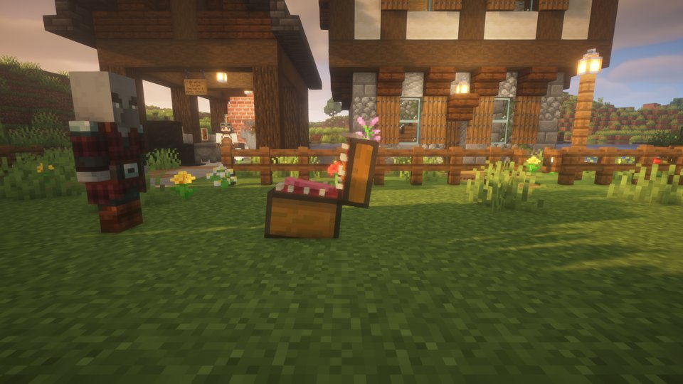 | 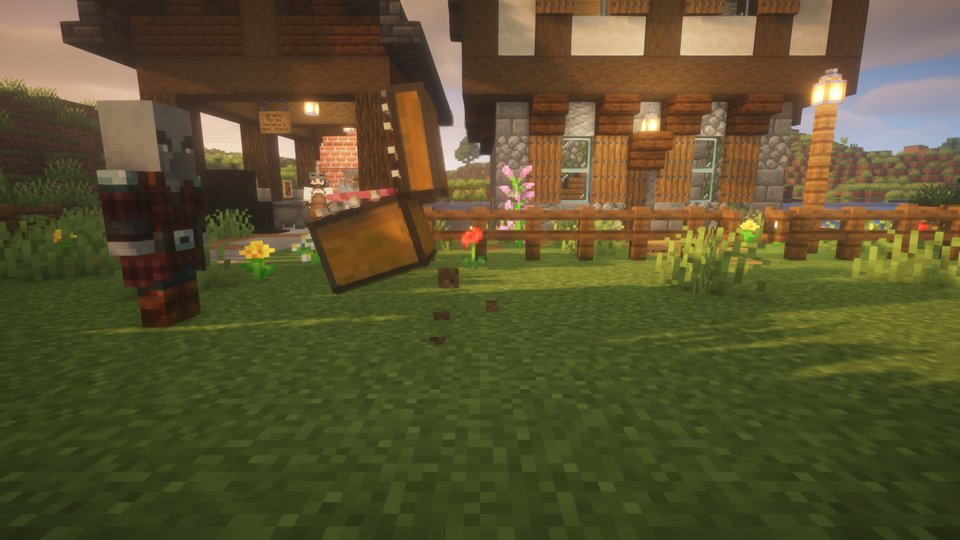 |

### Playing dead

A wild mimic that loses track of you snaps back onto the block grid and goes still. It uses the vanilla chest texture and casts no shadow, so up close it looks exactly like a chest, and it will match your resource pack too. Walk too close or right-click it and it wakes up.

Every mimic drops 1 to 3 Mimic Teeth (Looting adds more) along with the loot it holds.

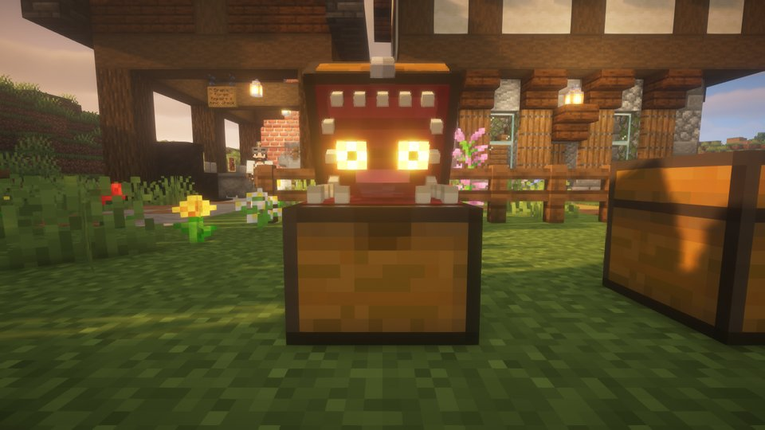

## The Treasure Lens

Hold a Treasure Lens in either hand and every unopened loot chest within 24 blocks gets marked. Gold sparks mean real treasure. Angry puffs mean teeth. It marks mimics that are playing dead too.

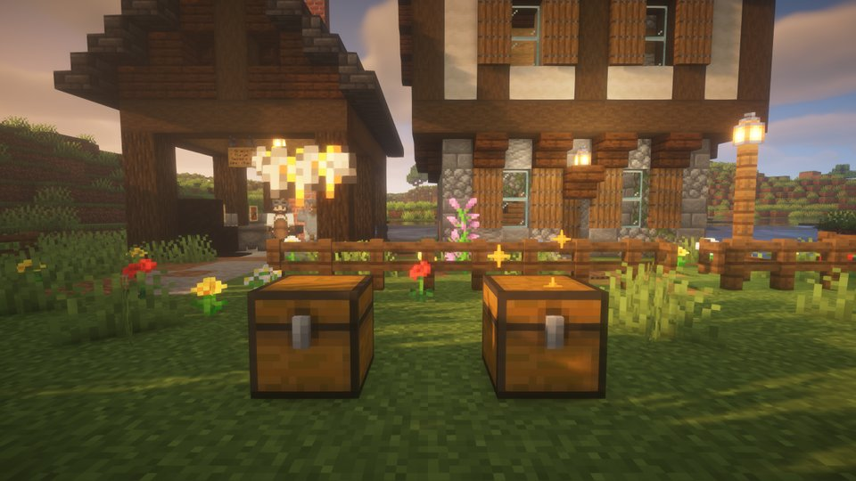

## Taming and the Luggage

A mimic loves gold more than it hates you. Feed it a gold ingot or raw gold **while it's trying to eat you**, and each one has a 1 in 3 chance to win it over.

A tamed mimic becomes your Luggage. It hops after you, bites anything that attacks you and pants with its tongue out. The tongue is also its health bar: level when it's healthy, hanging further over its lip the more it's been hurt.

| Tamed | Opened up |
|---|---|
| 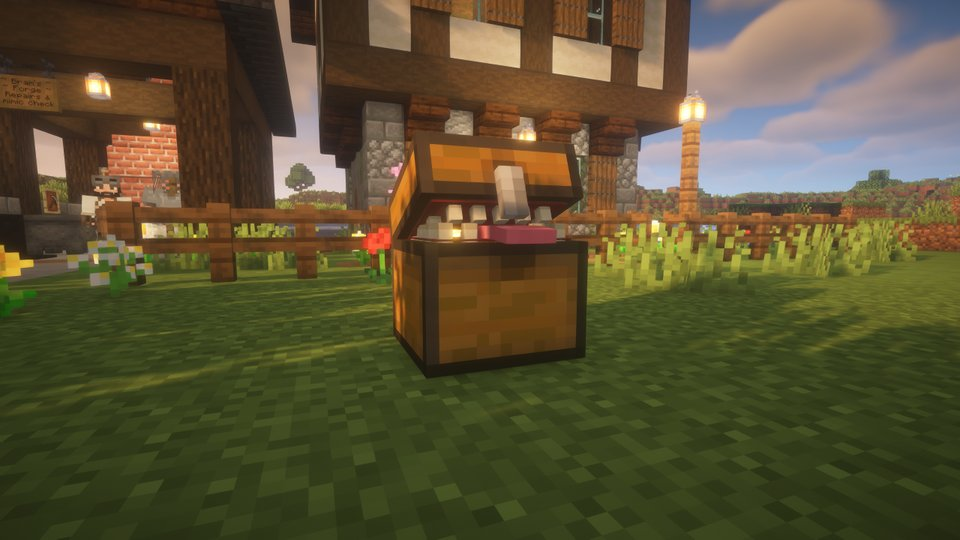 | 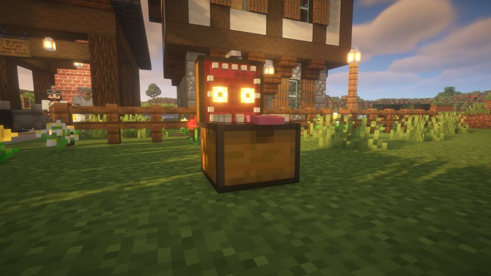 |

| Do this | And it will |
|---|---|
| Right-click | Open its 27-slot inventory. The lid swings up with chest sounds, and it holds still while you look. |
| Sneak and right-click | Sit or stand. Sitting, it shuts its lid, lines itself up with the block grid and passes for a chest. |
| Feed it gold | Heal. A nugget mends 1 heart, an ingot or raw gold mends 4, and a block of gold or raw gold heals it fully. |
| Nothing | It pulls in item drops within 6 blocks, gulps them down and sometimes burps. It leaves alone anything its owner threw away. |

If it dies, it drops everything it carries.

## The Mimic Chest

A chest, two Mimic Teeth and a block of gold make a Mimic Chest. It places like any chest and it's always a mimic, which makes it handy for traps, pranks and adventure maps. It never joins up with a chest next to it, so it stays a mimic wherever you put it.

## Hollowmere

> The old kings of Hollowmere built a keep in a cavern under the hills and lit it with sunstone, so their gardens would grow without the sun. The kingdom fell. The gardens didn't, and neither did the knights.

### The mine

Hollowmere Keep is rare. It turns up under plains, forests, taigas, meadows, savannas, cherry groves and windswept hills. From the surface all you'll see is an old timbered mine portal dug into higher ground and facing open land, in a yard of rubble with old rails, a derelict minecart, barrels, cobwebs, a cold campfire and a sign warning you off. A rail-lined stair shaft with timber frames leads down.

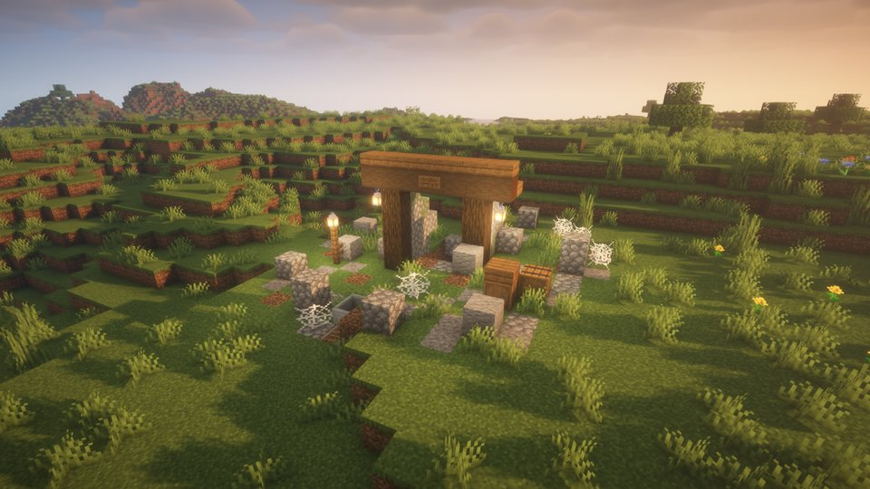

### The cavern

The shaft comes out on a balcony high on the wall of a huge domed cavern. Below is a meadow of grass, flowers, azalea trees and moss, lit by sunstone boulders. Glow berries and sunstone "stars" hang from the ceiling, fireflies drift over a pond, and in the middle stands a ruined castle. A spruce stair-bridge takes you down.

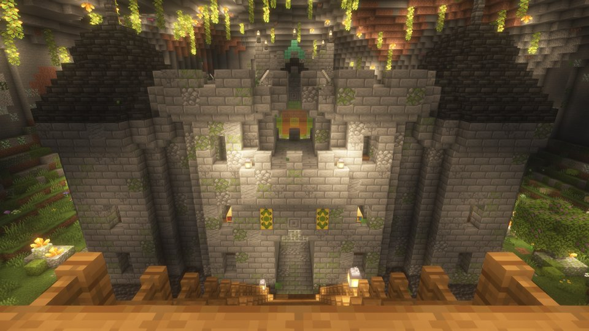

### The castle

A moat with stone quays and lamp posts rings the curtain walls. They stand on a battered deepslate footing, with buttresses, corbelled parapets, arrow slits and ivy, and whole stretches of them have fallen into rubble. Round corner towers have slate cone roofs, open battlements or just a broken stump. The twin-towered gatehouse has an arched gate, a half-raised portcullis, a lowered drawbridge and banners in Hollowmere's colours.

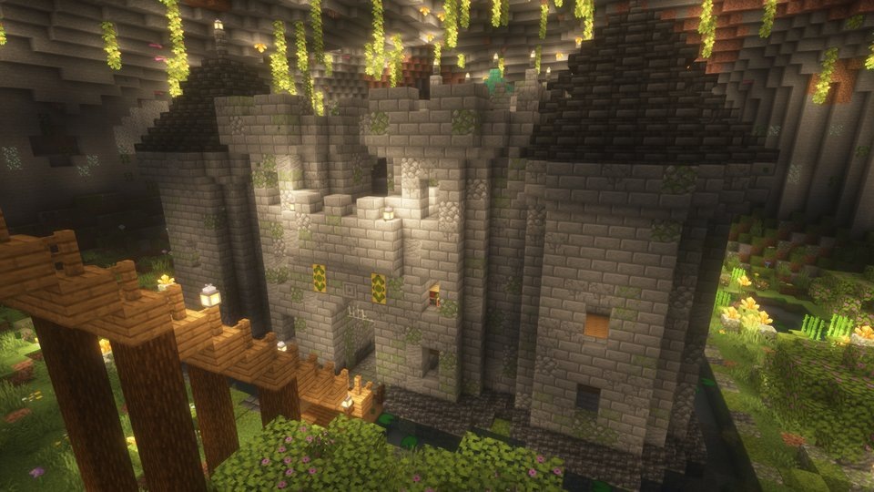

Inside you'll find a roofed well, a training yard, a stable along the west wall (one stall has a sleeping mimic in it) and a kitchen garden gone to seed. The great hall has lost its slate roof, which has fallen in over bare rafters, but the feast tables, iron chandeliers and gilded throne are still there. Behind it, a tall donjon with a verdigris copper roof holds an armory, a library and the king's bedchamber.

Chests are tucked all through the castle, and each of these hoard chests is a mimic half the time. Loot sits at the iron and copper tier.

Loot in the castle's chests and barrels is per player: everyone finds them full and loots their own copy. A chest you break or a mimic that jumps out at you is gone only for you, and other players still find it there.

### Moss Knights

Moss Knights guard the courtyard and keep watch from the gatehouse and the tower tops. They walk with slow, heavy strides and carry an oversized stone greatsword in both fists, raised on guard whenever they aren't swinging it. Every swing is telegraphed: the blade goes up, slams down fast, and takes a while to come back. The swing hits everything in front of them, so step back when you see the sword go up. Each knight drops a Knight's Sigil.

| On guard | Raising the greatsword |
|---|---|
| 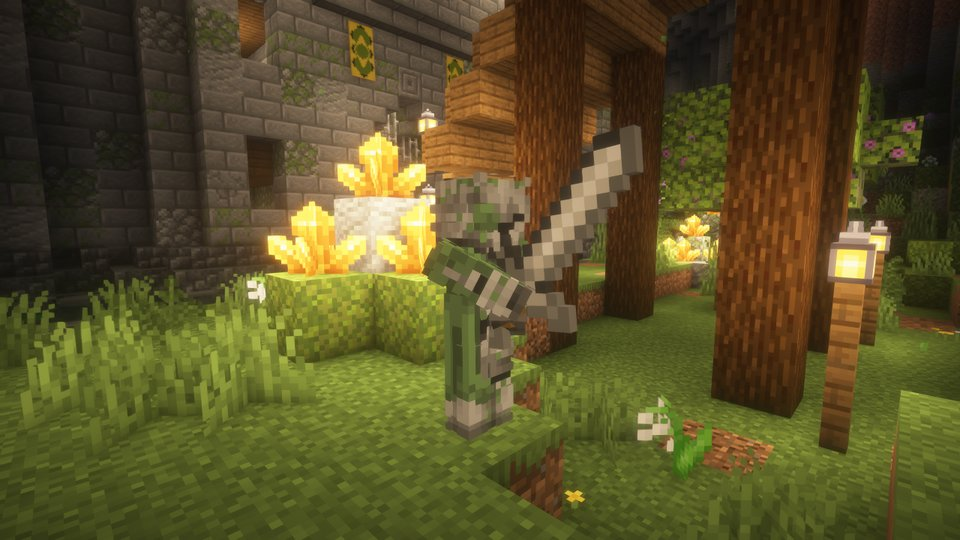 | 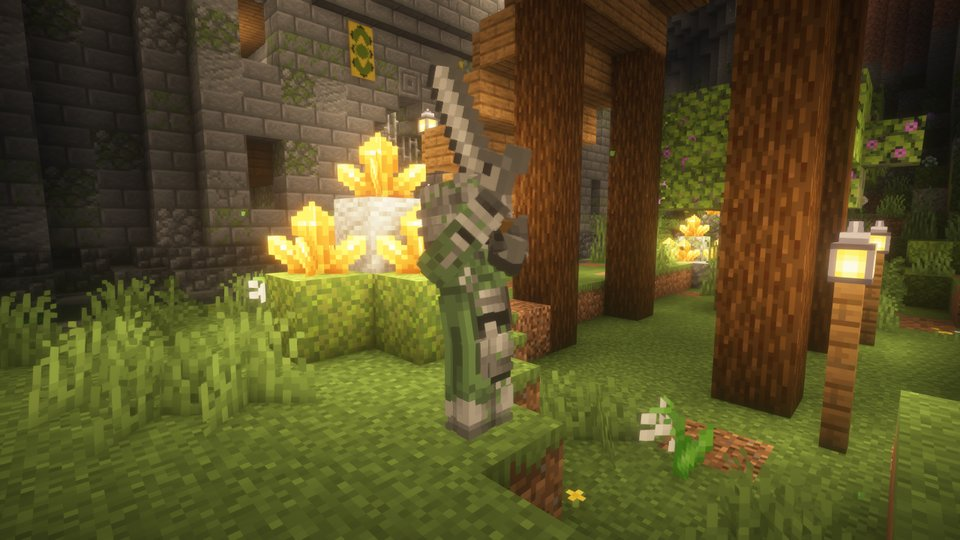 |

### The King's Coffer

Before the throne sits the King's Coffer, a giant mimic with a boss bar, guarding the Crown of Hollowmere. It can't be tamed, and cobwebs don't slow it down. When it wakes it bursts out of its throne: the blocks around it, three wide and three high, break and drop as if mined with a pickaxe.

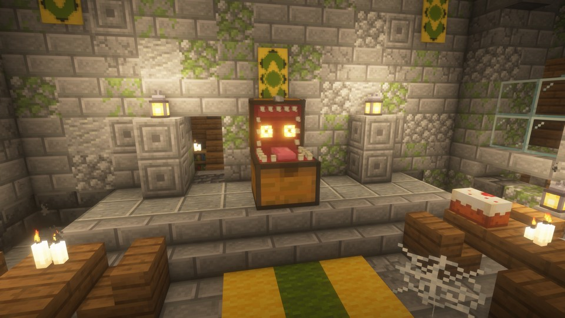

It follows you anywhere a zombie could: through the door behind the throne, down into the room beyond and up the narrow stair to the room above. It stays full size wherever it fits, shrinks to the size of an ordinary chest only to squeeze through a gap or up a stair, and grows back as soon as there's room.

From up to ten blocks away it crouches for a second and a half, leaning back as the ground cracks and gold glints under it. Then it leaps at the spot you're standing on, turns over in the air with its lid flung open, and crashes down almost upside down, mouth first, for five and a half hearts (unarmoured) on everything around it. It only leaps when its whole body clears the arc. Otherwise it keeps walking.

| Crouch | Leap | Crash |
|---|---|---|
| 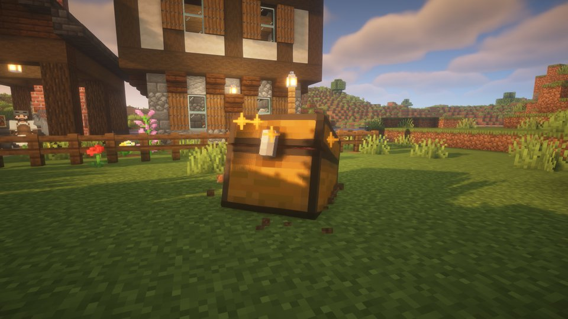 | 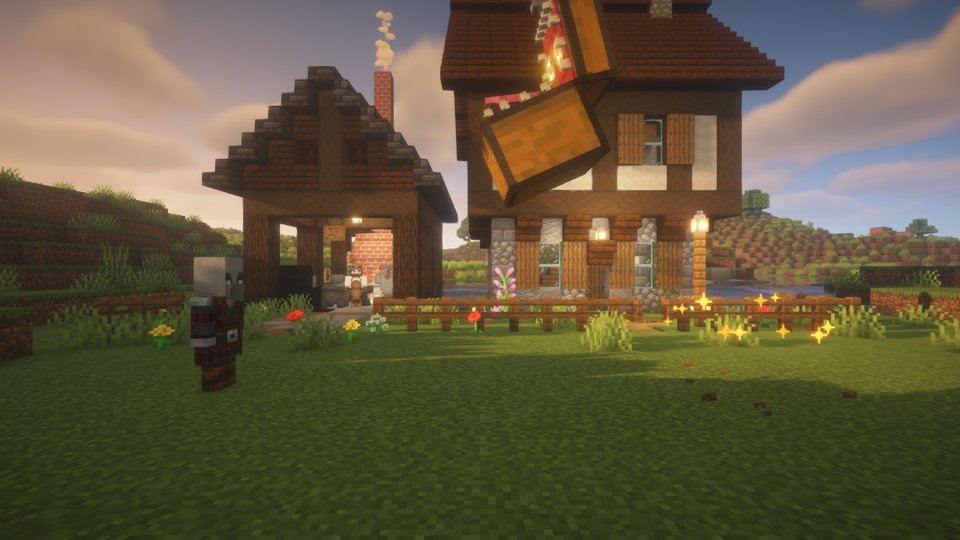 | 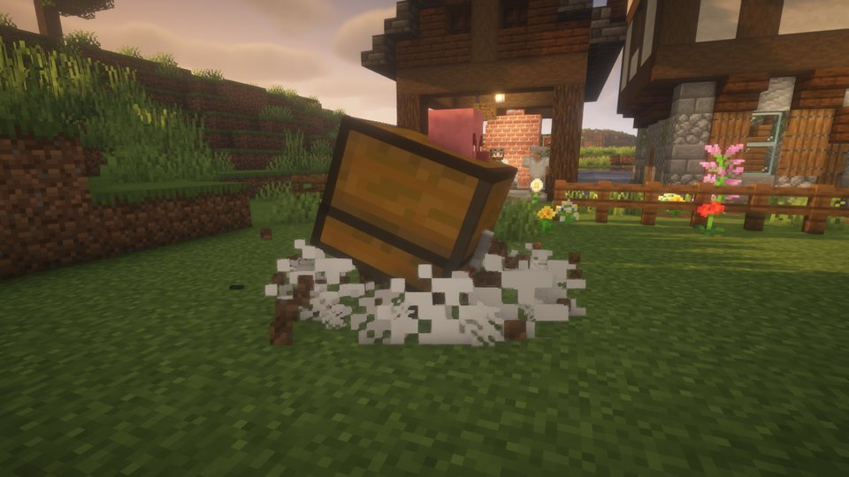 |

### The Crown of Hollowmere

The Coffer's prize is a crown you can wear. It's a helmet with golden helmet stats that comes enchanted, keeps piglins friendly and is repaired with gold. It can't be crafted. The crown textures come from IcebergLettuce's *Golden Crowns* resource pack.

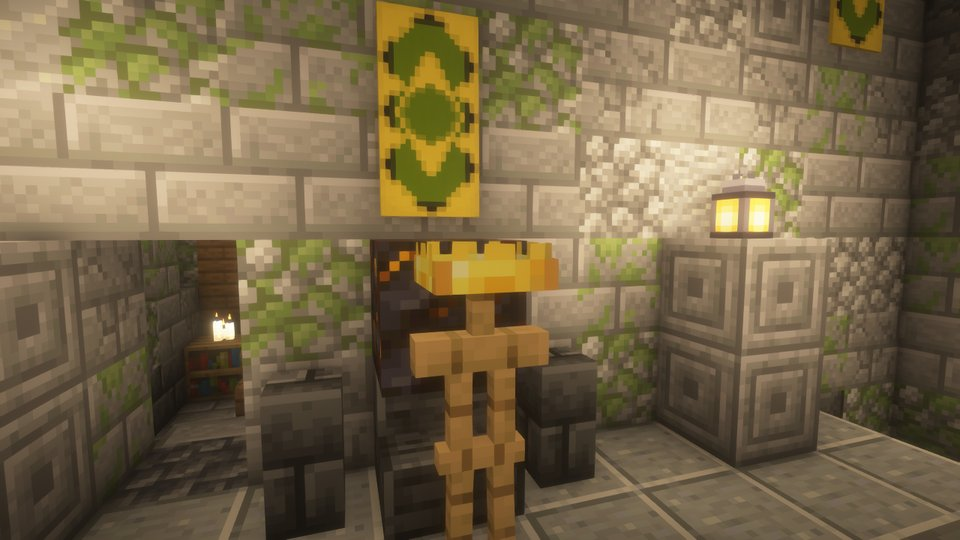

## The Wayside Forge

Every keep has a forge down the road, 80 to 100 blocks in front of the mine entrance and facing it: the old mine's smith still lives there. It's a two-storey cottage, stone below and jettied timber and plaster above, next to an open smithy under a slate roof. The smithy's brick chimney sends up signal smoke you can spot from a long way off.

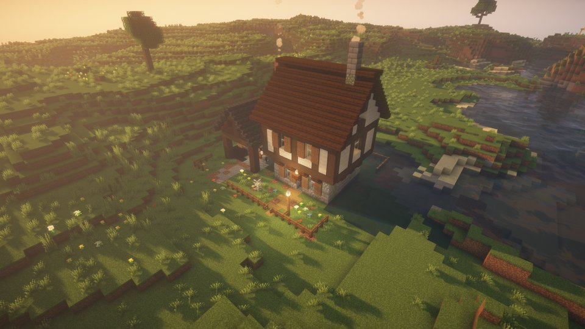

The land is shaped for the forge while the terrain generates, the same way vanilla levels ground for villages. It picks the spot that needs the least earthwork, then cuts a terrace into a slope, raises a pad out of a valley or builds up an island in a river. Since this happens before anything grows, the grass, trees and flowers around it are ordinary worldgen rather than patched in afterwards. The yard's ground takes after its surroundings too: podzol in giant taigas, mycelium on mushroom islands, stone on rocky slopes.

`/locate structure mimicry:wayside_forge` finds the forge, and `/locate structure mimicry:sunken_keep` finds the mine entrance.

### Bram the Blacksmith

Bram hammers at his anvil by day, opens doors, trades like a villager and sleeps in his bed at night. Right-click him to talk. If he's asleep, clicking him or his bed gets him up for a chat, and he goes back to bed after half a minute.

| Bram | Talking to him |
|---|---|
| 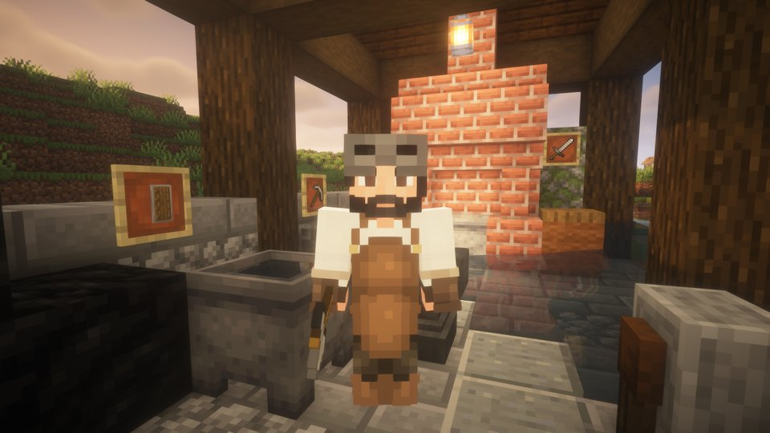 | 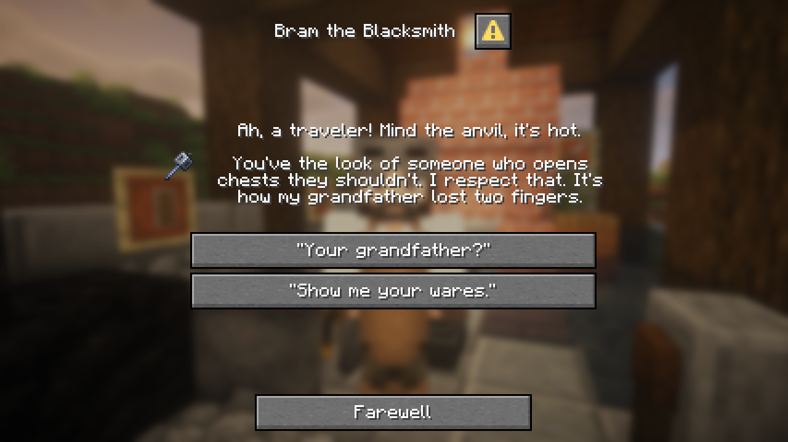 |

Bram can't die. Lethal damage knocks him flat instead: he lies on the ground, can't be hurt, and gets back up at full health after 60 seconds. `/kill` and the void still remove him.

### His request

1. Ask Bram about his grandfather. He tells you about Hollowmere and its knights and asks you to put them to rest.
2. Agree, and he hands you a map to the nearest keep and his *Almanac of Hollowmere*. If you lose the map, he'll draw you another. The next time you enter a keep, any missing knights are back at their posts and a beaten King's Coffer is back on its throne.
3. Bring him three Knight's Sigils. He takes them and gives you his grandfather's Shield of Hollowmere (Unbreaking III), 8 emeralds and 3 Sunstone Lanterns.

### Trades

| You give | You get |
|---|---|
| 6 Iron Ingots | 1 Emerald |
| 4 Mimic Teeth | 1 Emerald |
| 1 Knight's Sigil | 3 Emeralds |
| 2 Emeralds | 2 Sunstone Lanterns |
| 6 Emeralds | Treasure Lens |
| 4 Emeralds and 2 Mimic Teeth | Mimic Chest |
| 3 Emeralds | Shield |

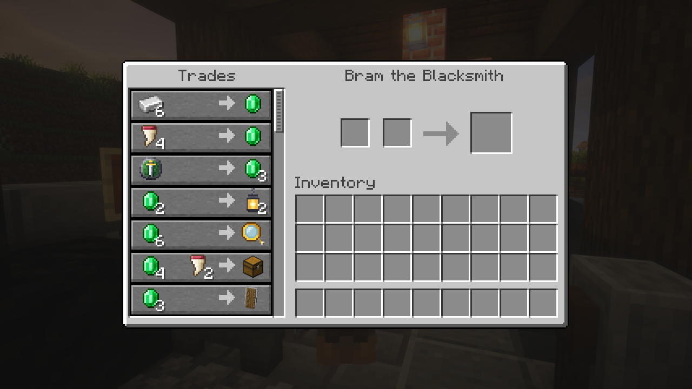

## The Almanac of Hollowmere

Bram's almanac opens as an illustrated two-page book. It starts with a short tale of the hungry chest and a clickable contents page, then gives a spread each to mimics, the Treasure Lens, taming, the Luggage, the Mimic Chest, the King's Coffer, the keep, its knights, sunstone and chimneys. Recipes sit on the page in real slots with item tooltips, tag ingredients cycle through their options, and a mimic in the margin watches your cursor.

| | |
|---|---|
| 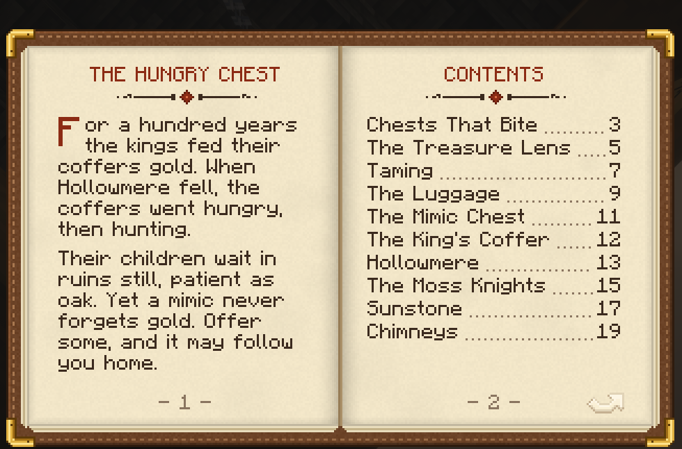 | 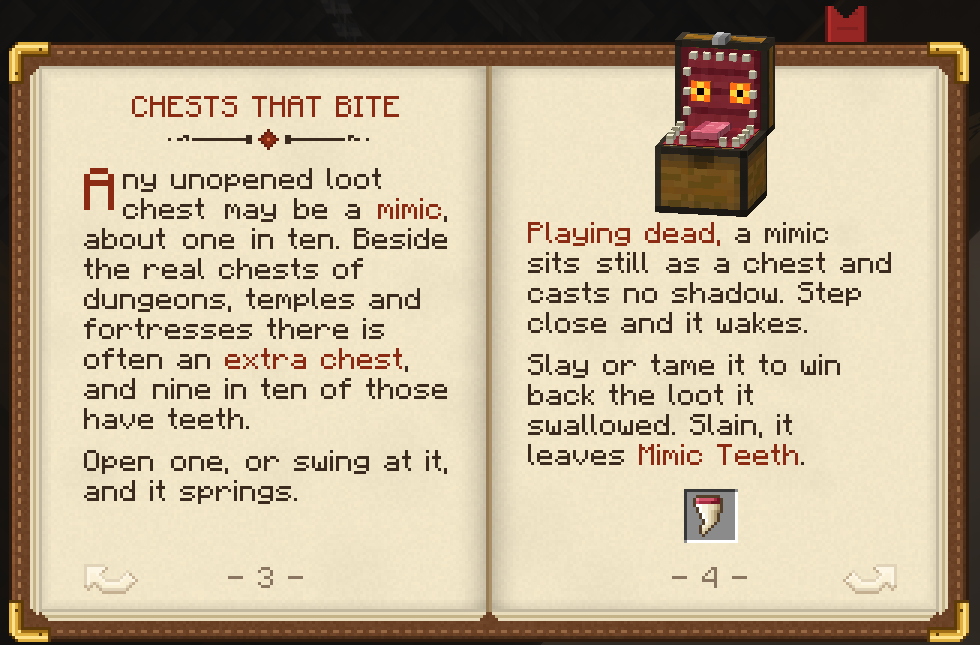 |
| 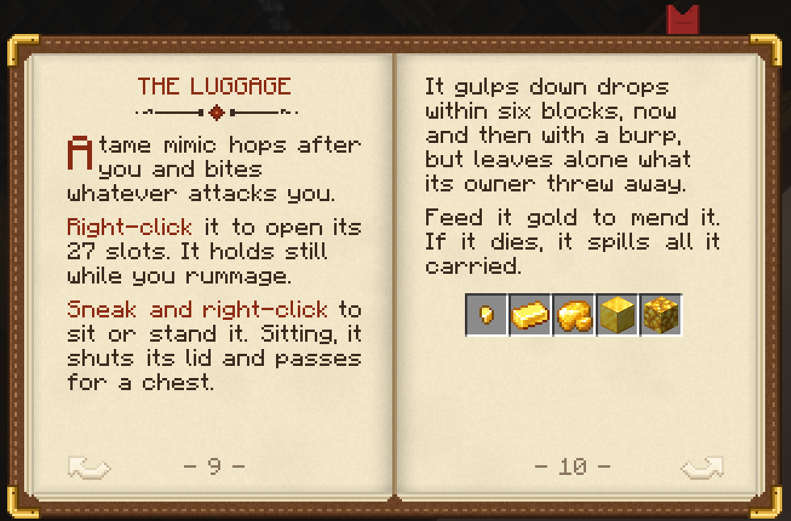 | 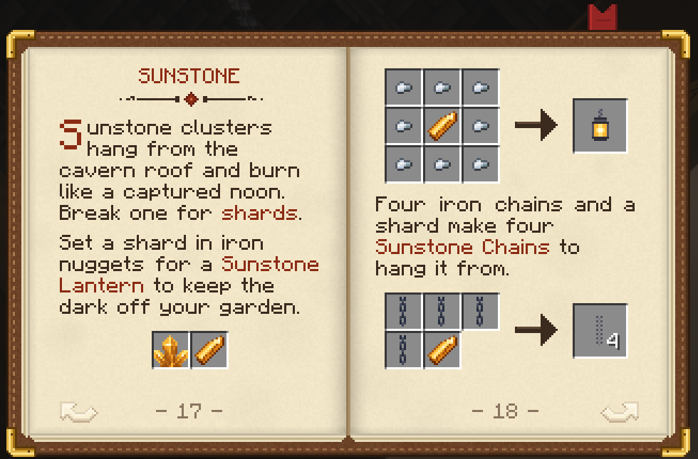 |

Turn pages with the arrow keys, Page Up and Page Down or the scroll wheel. The red ribbon (or Home) takes you back to the contents.

It sits on a lectern like any written book. The keep's library and Bram's forge each have one on display, turning its pages drives a comparator the way a book's would, and there's a Take Book button. Copies also turn up in dungeon, mineshaft, stronghold library and village smith chests.

## Sunstone and chimneys

Sunstone Clusters give off light level 15 and drop Sunstone Shards. A shard set in iron nuggets makes a Sunstone Lantern, which flickers softly. Four iron chains and a shard make four Sunstone Chains that match the lantern's handle. The keep's hanging lanterns hang from them.

A campfire walled in with bricks makes a Brick Chimney; with stone bricks, a Stone Brick Chimney. The top is a round flue set into the masonry. It puffs smoke like a campfire, and with a hay bale underneath it sends up the tall signal column. The Wayside Forge's chimneys are topped with them.

## Recipes

| Item | Recipe |
|---|---|
| Treasure Lens | 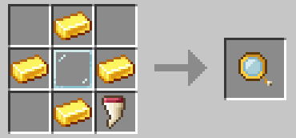 |
| Mimic Chest (any arrangement) | 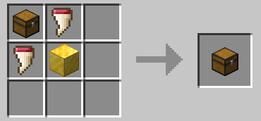 |
| Sunstone Lantern | 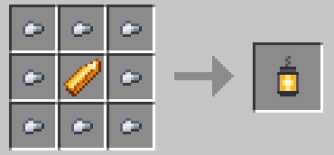 |
| 4 Sunstone Chains (any arrangement) | 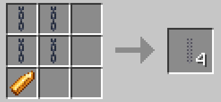 |
| Brick Chimney | 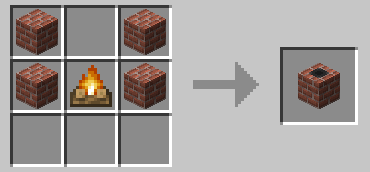 |
| Stone Brick Chimney | 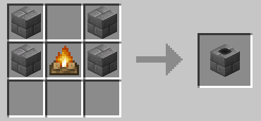 |

## Items at a glance

| Item | Where it comes from |
|---|---|
| Mimic Tooth | Dropped by mimics |
| Treasure Lens | Crafted, or bought from Bram |
| Mimic Chest | Crafted, or bought from Bram |
| Knight's Sigil | Dropped by Moss Knights |
| Sunstone Cluster | Hollowmere's cavern. Needs Silk Touch to keep; otherwise it drops shards |
| Sunstone Shard | Broken Sunstone Clusters |
| Sunstone Lantern and Sunstone Chain | Crafted. Bram also sells lanterns |
| Brick Chimney and Stone Brick Chimney | Crafted |
| Almanac of Hollowmere | Bram, the lecterns at the keep and the forge, and some vanilla chests |
| Crown of Hollowmere | Guarded by the King's Coffer |
| Shield of Hollowmere | Bram's reward for three Knight's Sigils |

Everything the mod adds is in the **Mimicry** creative tab. The spawn eggs are in the vanilla Spawn Eggs tab.

## Advancements

| Advancement | How to get it |
|---|---|
| Some Chests Bite Back | Get bitten by a mimic |
| Trust Issues | Craft a Treasure Lens |
| Who's a Good Chest? | Tame a mimic |
| Under the Hill | Find Hollowmere Keep |
| Relieved of Duty | Put a Moss Knight to rest |
| The Smith's Request | Bring Bram three Knight's Sigils |

## Older Minecraft versions

Everything works the same on every version, apart from things the older game doesn't have:

- 1.21.1 and 1.20.1 have no vanilla dialogs, so Bram's conversations open in a screen of the mod's own.
- The cavern's wildflowers are pink petals and its firefly bushes and bushes are ferns. Copper armor and swords in the keep's loot are chainmail and stone.
- On 1.20.1, the castle's tuff bricks are stone bricks. The game has no mace sounds, so on first launch the client downloads the two the knights and the King's Coffer use from Mojang's asset server, the same way the launcher gets its sounds. Offline, they fall back to similar vanilla sounds.

## For modpacks and datapacks

| Setting | Default | What it does |
|---|---|---|
| `/gamerule mimicry:mimic_chance <0-100>` | `10` | Percent of ordinary loot chests that are mimics. |
| `/gamerule mimicry:primed_mimic_chance <0-100>` | `90` | Percent of extra chests that are mimics. At `0`, newly generated chunks get no extra chests. |
| `mimicry:primed/<namespace>/<path>` loot tables | see below | A structure chest with loot table `<namespace>:<path>` gets an extra chest only if this table exists. The shipped ones point back at the vanilla table. Add your own to opt more structures in, modded ones included, as long as they place chests through `StructurePiece.createChest`. |
| `#mimicry:mimic_food` item tag | gold ingot, raw gold | What tames mimics. |
| `mimicry:entities/mimic` loot table | 1 to 3 teeth | Extra drops. The chest loot inside the mimic drops separately. |
| `mimicry:chests/sunken_keep`, `sunken_keep_armory`, `kings_coffer` | iron and copper tier | Keep loot. |
| `mimicry:gameplay/almanac`, `keep_map`, `bram_reward` | | The almanac, Bram's map and his reward. |
| `mimicry:sunken_keeps` and `mimicry:wayside_forges` structure sets | spacing 34 chunks | How often they generate. |
| `#mimicry:has_structure/sunken_keep` and `wayside_forge` biome tags | | Where they generate. |
| `mimicry:dialog/bram/*` | | Bram's conversation screens (vanilla dialogs). Their buttons run `/mimicry bram accept`, `trade` or `turnin`. On 1.21.1 and 1.20.1 the mod shows the same files in a screen of its own, read from the mod jar. |

On 1.21.1 and 1.20.1 the game rules are named `mimicry.mimic_chance` and `mimicry.primed_mimic_chance`, and on 1.20.1 datapacks use the plural folder names (`loot_tables`, `recipes`, `advancements`).

Extra chest tables shipped for `minecraft:chests/`: `simple_dungeon`, `nether_bridge`, `desert_pyramid`, `jungle_temple`, `stronghold_corridor`, `stronghold_crossing`, `stronghold_library`, `end_city_treasure` and `shipwreck_treasure`. A structure piece gets at most one extra chest, and none if it has no sensible floor spot near its chest.
